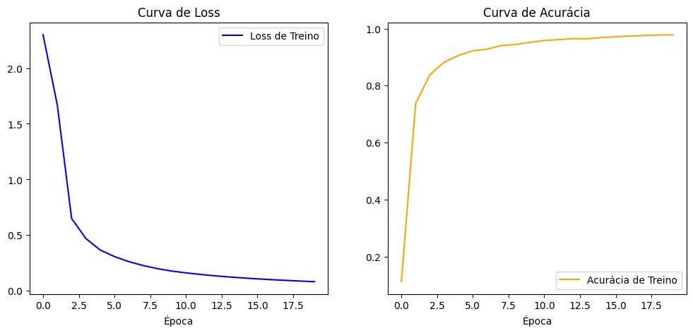
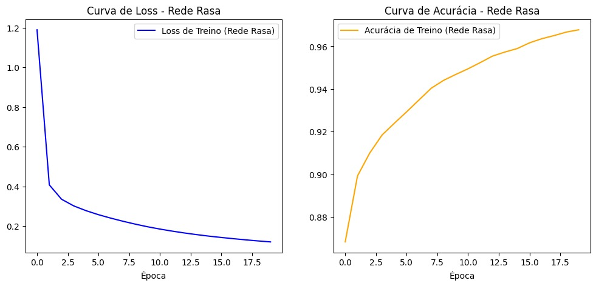

# Multi-Layer Perceptron (MLP) do Zero

Esta é uma implementação de um Multi-Layer Perceptron (MLP) desenvolvida do zero utilizando apenas NumPy, como atividade ponderada da semana 7.

## Como rodar
1. Crie um ambiente virtual e ative-o:
   ```bash
   python -m venv .venv
   source .venv/bin/activate
   ```
2. Instale as dependências:
   ```bash
   pip install -r requirements.txt
   ```
3. Abra o arquivo `notebooks/experimentos.ipynb` no VS Code ou Jupyter, selecione o kernel referente ao `.venv` criado e execute as células.
4. Para validar as partes opcionais do projeto, execute os testes unitários com:
   ```bash
   python -m unittest discover -s tests
   ```

## Estrutura do repositório

```text
.
├── README.md
├── requirements.txt
├── mlp/
│   ├── __init__.py
│   ├── activations.py
│   ├── losses.py
│   ├── network.py
│   └── optimizers.py
├── notebooks/
│   └── experimentos.ipynb
├── results/
│   ├── curva_experimento1.png
│   ├── curva_experimento2.png
│   ├── matriz_confusao.png
│   ├── pca_embedding.png
│   └── hidden_activations_pca.png
└── tests/
    ├── test_activations.py
    └── test_optimizers.py
```

Esta estrutura organiza o código da rede em `mlp/`, os experimentos em `notebooks/`, os artefatos gerados em `results/` e os testes de validação em `tests/`.

## Arquitetura escolhida
A arquitetura principal foi construída visando um bom balanço entre poder de representação e tempo de treinamento em CPU. Abaixo estão as configurações e os motivos de cada escolha:
- **Entrada (784 neurônios):** Quantidade definida obrigatoriamente para corresponder à vetorização da matriz de 28x28 pixels das imagens do MNIST.
- **Camadas Ocultas (128 e 64 neurônios):** Optei por duas camadas em um formato de "funil". Essa escolha força a rede a comprimir as informações e extrair as características essenciais gradativamente (aprendizado hierárquico). Os números 128 e 64 mantêm a rede leve para executar rápido apenas em CPU, além de serem potências de 2 (o que em alguns níveis ajuda na otimização de memória dos arrays do NumPy).
- **Saída (10 neurônios):** Necessário ter um neurônio para cada classe de dígito possível (0 a 9).
- **Funções de Ativação:** Utilizei a **ReLU** nas camadas ocultas porque sua matemática é muito leve (apenas `max(0, x)`) e ela previne o problema de *vanishing gradients* encontrado na Sigmoid. Para a última camada, usei a **Softmax**, que é essencial para transformar as saídas brutas (*logits*) em uma distribuição de probabilidade onde a soma total é 1, facilitando a escolha da classe correta.
- **Otimização:** A base do experimento foi a **Descida de Gradiente Estocástica (SGD) com mini-batches** (128 amostras) e a perda de **Cross-Entropy**. Escolhi treinar em mini-batches ao invés de amostra-a-amostra (muito ruído) ou no dataset todo de uma vez (muito custo de memória), pois isso equilibra bem a velocidade computacional e a estabilidade da atualização dos pesos. A função de *Cross-Entropy* foi a escolhida porque ela atua perfeitamente junto da Softmax, penalizando fortemente predições confiantes e erradas. Além disso, implementei o otimizador **Adam** em `mlp/optimizers.py` como uma alternativa adicional para comparar a convergência e a estabilidade do treinamento.
- **Testes unitários:** Também incluí testes em `tests/test_optimizers.py` e `tests/test_activations.py` para verificar o comportamento do otimizador Adam e das funções ReLU/Softmax e suas derivadas. Essa camada extra ajuda a confirmar que as partes matemáticas principais continuam corretas durante o desenvolvimento.
- **Gradient check numérico:** No notebook `notebooks/experimentos.ipynb`, adicionei uma verificação numérica dos gradientes para comparar o backpropagation analítico com uma aproximação por diferenças finitas. Essa etapa ajuda a validar a correção dos gradientes antes de usar a rede em treinos maiores.
- **Visualização de embeddings (PCA):** Também incluí uma visualização de embeddings via PCA no notebook `notebooks/experimentos.ipynb`, usando um espaço 2D para observar como os pontos do MNIST se agrupam por classe. Essa análise complementar ajuda a interpretar a estrutura interna dos dados e a qualidade da representação aprendida.
- **Visualização das ativações internas:** Incluí uma projeção PCA das ativações da primeira camada oculta da rede. Essa visualização mostra como a representação intermediária da MLP organiza as classes antes da camada de saída, oferecendo uma leitura intuitiva do comportamento interno da rede.

## Resultados

Para atingir os requisitos completos do projeto, realizei comparações de hiperparâmetros e arquitetura. Os resultados estão resumidos na tabela abaixo:

| Experimento | Arquitetura | Learning Rate | Batch Size | Épocas | Acurácia no Teste |
| :--- | :--- | :--- | :--- | :--- | :--- |
| **1 (Principal)** | `[784, 128, 64, 10]` | 0.05 | 128 | 20 | **96,72%** |
| **2 (Rede Rasa)** | `[784, 64, 10]` | 0.05 | 128 | 20 | **96,17%** |

Como esperado, a rede com apenas uma camada oculta sofreu uma leve queda de desempenho (de 96,72% para 96,17%). A profundidade extra do Experimento 1 ajudou a rede a extrair características mais complexas das imagens, porém ambas atingiram o requisito mínimo (≥ 92%).

### Gráficos do Treinamento

**Experimento 1 (Arquitetura Principal):**  


**Experimento 2 (Rede Rasa):**  


## Decisões e dificuldades

**1. Qual foi a decisão técnica mais difícil que você tomou? Por que fez essa escolha?**  
A decisão técnica mais desafiadora foi garantir a estabilidade do *backpropagation*. Para isso, decidi combinar o cálculo da derivada da *Cross-Entropy Loss* com a função de ativação *Softmax* na última camada. Fiz essa escolha porque matematicamente as derivadas se cancelam e resultam em uma fórmula muito mais simples (apenas a diferença `Predição - Rótulo Real`). Essa decisão me poupou de lidar com cálculos complexos de matrizes Jacobianas e evitou instabilidade numérica que faria o aprendizado travar.

**2. O que você tentou que não funcionou? O que aprendeu com isso?**  
No começo do desenvolvimento, eu tentei iniciar o treinamento com pesos inicializados de forma puramente aleatória (com números muito grandes) ou todos em zero. Isso definitivamente não funcionou: a rede entrava num estado de *vanishing* ou *exploding gradients* e a loss simplesmente não caía. Aprendi na prática a importância fundamental da etapa de inicialização de pesos na modelagem de redes neurais, e como a escala correta dos números gerados é que dita se a rede será capaz de começar a aprender.

**3. Se fosse refazer do zero, o que faria diferente?**  
Se eu fosse refazer do zero, implementaria imediatamente uma função de *Gradient Check* (aproximação numérica de derivadas) assim que escrevesse a lógica do *backpropagation*, e criaria testes unitários. Gastei um bom tempo debugando erros nas matrizes (problemas com o formato nos produtos internos `np.dot`). Ter uma validação automática pouparia o tempo gasto tentando debugar a matemática analisando as saídas diretamente. Também vale destacar que, após adicionar o otimizador **Adam** ao fluxo de treinamento, percebi que ele pode acelerar a convergência e reduzir a oscilação da loss em comparação com o SGD em alguns treinos.
